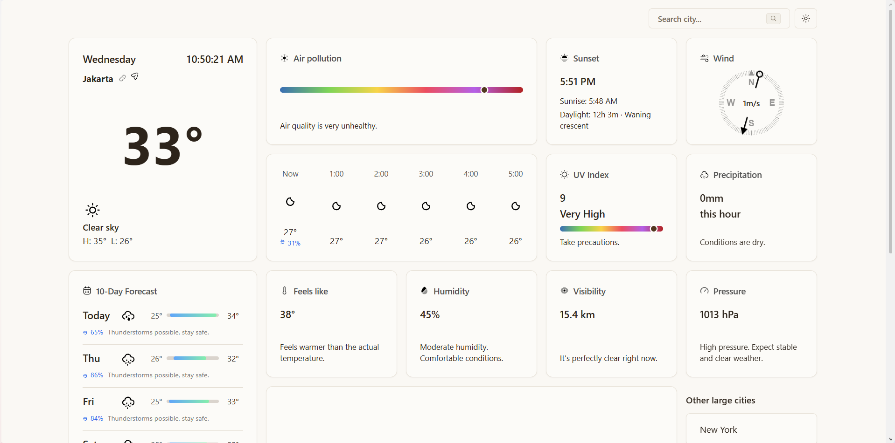

# Meteo-nix 🌏



## Overview

Meteo-nix is a keyless weather app built with Next.js 16, React 18, TypeScript, Tailwind CSS, and shadcn/ui. All weather data comes from Open-Meteo (forecast, air quality, geocoding), and live radar comes from RainViewer — no API keys required.

## Features

- **Current Conditions:** temperature, humidity, wind speed/direction, pressure, visibility, and UV index.
- **Forecast:** 24-hour hourly breakdown and a 10-day outlook, with per-day rain probability and practical daily tips.
- **Severe Weather Alerts:** dismissible alert banners for active warnings.
- **Live Radar:** RainViewer precipitation overlay with animated replay, play/pause, and a frame slider.
- **Map Popup:** click anywhere on the map to see current temperature and conditions at that point.
- **Air Quality:** European AQI readings for the selected city.
- **Command Menu:** open with `⌘J` / `Ctrl+J` to search any city, geolocate to "My Location", or jump back to recently viewed cities (persisted locally).
- **Sun & Moon:** sunrise/sunset times, daylight hours, and moon phase.
- **Share:** copy a link to the current city's forecast.
- **PWA:** installable and offline-capable via service worker (production build).
- **Theme Toggle:** light, dark, or system via `T` shortcut.

## Tech Stack

- **Framework:** Next.js 16, React 18, TypeScript
- **Styling & UI:** Tailwind CSS, shadcn/ui, Radix UI, lucide-react
- **Maps:** maplibre-gl, react-map-gl
- **Command Menu:** cmdk, react-hotkeys-hook
- **Data:** Open-Meteo (forecast, air quality, geocoding), RainViewer (radar)
- **Analytics:** Vercel Analytics

## Run Locally

```bash
npm install
npm run dev
```

Build and serve:

```bash
npm run build
npm run start
```

Lint:

```bash
npx eslint .
```

## Environment Variables

None required. All data sources are keyless; `.env.local` is reserved for future use.

## Authors

Inspired by [Darius Lukasukas' nextjs-weather-app](https://github.com/DariusLukasukas/nextjs-weather-app).

## Acknowledgements

- [Open-Meteo](https://open-meteo.com) — weather, air quality, and geocoding APIs
- [RainViewer](https://www.rainviewer.com) — radar imagery
- [maplibre](https://maplibre.org) and [shadcn/ui](https://ui.shadcn.com) — maps and UI primitives